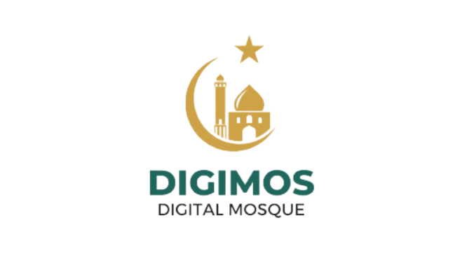

### Digimos (Digital Mosque) 
sebuah platform digital yang dirancang khusus untuk mempermudah manajemen masjid secara modern dan terintegrasi. Digimos membantu pengurus masjid mengelola data jamaah, keuangan, donasi, zakat, jadwal kegiatan, serta memberikan akses mudah kepada jamaah untuk terlibat aktif dalam kegiatan masjid. Sistem ini juga mendukung transparansi, keamanan, dan kenyamanan dalam pengelolaan masjid dengan fitur yang dapat diakses kapan saja melalui perangkat mobile. Dengan teknologi inovatif, Digimos memperkuat interaksi antara masjid dan jamaah serta mempercepat pengambilan keputusan strategis melalui data yang terstruktur.

- Pengelolaan data masjid terpusat dan terstruktur
- Transparansi keuangan dengan pencatatan transaksi digital
- Kemudahan pengelolaan jadwal kegiatan masjid
- Akses informasi waktu sholat akurat berdasarkan lokasi
- Pengelolaan donasi dan zakat
- Integrasi dengan media sosial untuk komunikasi lebih luas
- Bisa diakses dari berbagai perangkat
- Dashboard analisis data yang membantu pengambilan keputusan
- Keamanan data jamaah dan masjid yang terjamin
